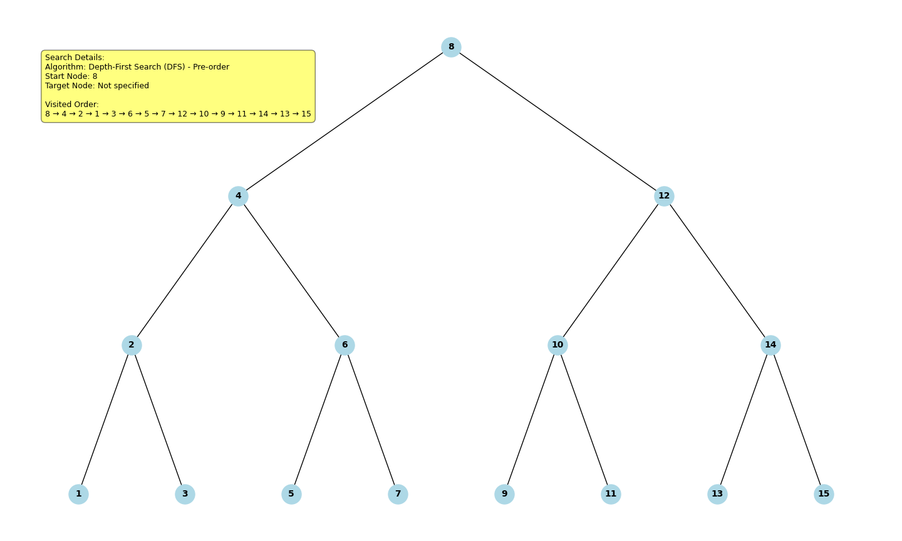
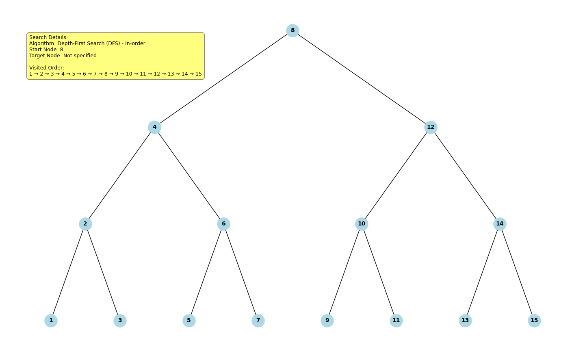
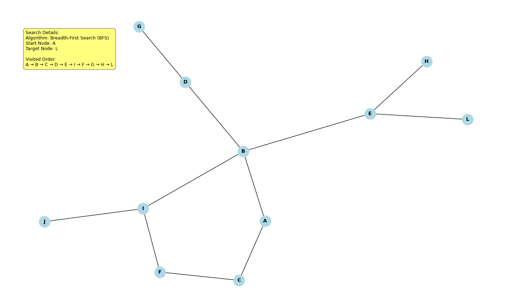
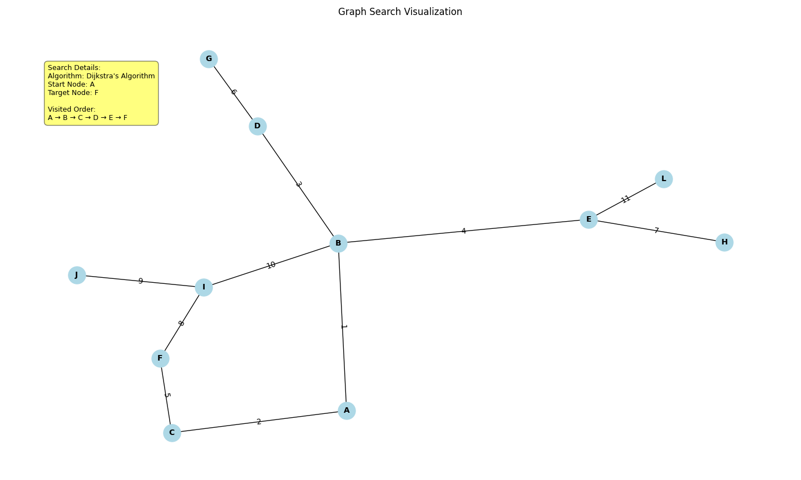
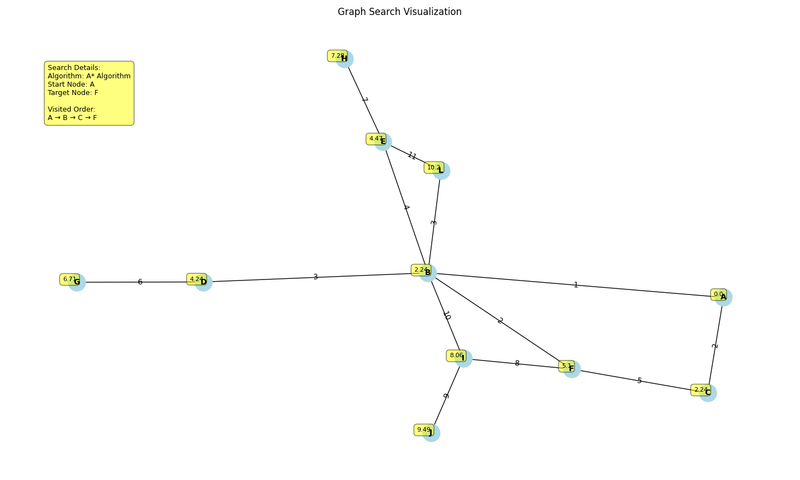

# Final Project Report
by **Derek Marion**

## Table of Contents
- [Introduction](#Introduction)
- [Analysis](#Analysis)
- [Conclusion](#Conclusion)

## Introduction 

### Context
The intent of this project was to construct an educational tool that tested my ability to implement 
specific data structures and search algorithms in Python. This helped solidify concepts learned in 
class and resulted in a useful tool for visualizing search algorithms that can be used as a study 
aid for technical interviews by myself and others.

### Why this is important/useful
The reason my topic is personally relevant to me is that, as a computer science student, my 
knowledge and mastery of data structures and algorithms directly affects my employability. I’ve 
found that the sheer breadth of knowledge required to be competitive in this job market is somewhat
overwhelming. Technical interviews are often conducted on data structures and algorithms topics. It
would be personally helpful to me (and probably other job-seekers) to have a convenient tool for 
visualizing these concepts to serve as a preparatory aid for job interviews.

## Analysis

### Steps - What and Why

I wasn't precisely trying to answer a question using class concepts for this project. Rather, I wanted to test my programming abilities and understanding of concepts taught in class - this was my "why". The exact steps in solving this problem involved:
- Deciding which data structures and algorithms to implement
- Deciding on a minimum viable product and desired feature set
- Selecting libraries which would support the MVP and feature set
- Writing the code


### Modules Referenced

The project almost exclusively dealt with the "Graphs and Trees" module of the course. I had a difficult time understanding and executing BFS, DFS etc. on paper in class, so I thought it would help solidify my understanding to implement these algorithms programmatically, using visual aids.

### Breakdown of Algorithms and Process

This project primarily relied on the NetworkX for graph creation and matplotlib for visualization. The intent was to create a framework for visualizing common data structures and search algorithms. I originally hoped to implement a feature where the user would be able to step through the various steps of a search algorithm, but I found out too late that the networkx and matplotlib libraries don't really support interactivity or dynamic updates of graphs. Later, I may try to refactor and create a UI from scratch (using tkinter, for example) that supports interactivity.

I'll now go over the data structures and algorithms that I implemented in this project:

### DFS

The primary challenge in implementing DFS for this project was using networkx to generate a proper binary search tree. It doesn't do this natively, so I had to hard-code a graph that represented a BST, and then write a custom method to display it properly in a pyramidal fashion in matplotlib.

```python
   height = get_tree_height(self.graph)
        pos = {}

        # Process nodes level by level
        for level in range(height + 1):
            # Find nodes at this level (distance from root)
            level_nodes = [
                node
                for node in self.graph.nodes()
                if len(nx.shortest_path(self.graph, 8, node)) - 1 == level
            ]

            # Calculate width of this level
            level_width = len(level_nodes)

            # Position nodes horizontally
            for i, node in enumerate(sorted(level_nodes)):
                x = (i - (level_width - 1) / 2) / (level_width / 2)
                y = 1 - (level / height)
                pos[node] = (x, y)

        return pos
```

Actually, the above code snippet took me the most amount of time of anything else in the project. I was surprised that networkx did not have built-in methods to generate and visualize BSTs, so it was quite a challenge to figure out how to do this from scratch. I spend a great deal of time tinkering with a networkx's balanced tree generation method and wondering why my DFS algorithms were not working as intended, only to realize that networkx doesn't support balanced BST generation specifically. After realizing that I had to hard code a properly balanced BST from scratch, I was able to complete my programmatic implementations.






### BFS

The BFS algorithm was a lot more straightforward to implement because I didn't have to wrestle with BSTs, and creating an acceptable graph using networkx was straightforward. It was also the easiest to implement becuause the programmatic implementation of this algorithm very closely aligns with how it is done on paper (i.e. with a queue), so the concept as it was taught in class translated quite easily.



### Dijkstra

I was surprised how easy it was to implement Dijkstra's algorithm programmatically given how difficult it can be to do on paper. Networkx had methods to find the shortest path, but obviously I wanted to implement my own algorithm to get the most value out of the project. I think what made it easy to implement is that there is very little conditional logic or additional data management compared to BFS and DFS, because all you have to do is explore all nodes, prioritizing the lowest-cost path first.



### A*

A* also took very little time to implement, because the only functional difference between it and Dijkstra is the addition of a heuristic. After creating a data structure that included a heuristic (I used the distance from the source node), the algorithm was basically the same but sorted nodes with the addition of their heuristic to the path cost. I tried to use a data structure which demonstrated that this algorithm can be more effective than Dijkstra with the correct heuristic.



## Conclusion

### Answer Question
Again, I wasn't precisely trying to answer a question in this project. The point was to solidify my understanding of search algorithms and data structures taught in class, and hopefully end up with a useful software tool.

### Weaknesses, Limitations, and Plans for Future Development
I encountered some limitations during this project with the UI aspect of the program. Too late in the process, I discovered that networkx and supporting libraries don't adequately support the type of interactivity I was hoping for. For example, I was hoping to include a feature for the user to "step-through" the various steps in a search algorithm (accompanied by changes in the UI such as highlighting the active node), but the library doesn't really support this. 

Later, I plan to refactor the UI of this project from scratch using a graphical library such as tkinter to help support this type of functionality. Fortunately, I can recycle the programmatic implementation of the algorithms I already wrote. Frankly, the most challenging aspects of this software project had to do with the front end, not the algorithms themselves.

Some planned features:
- Ability to step through algorithms
- Node highlighting
- Final path highlighting
- Dynamic data structure generation

### Reflection

I learned a lot from this project. I solidified my understanding of data structures and algorithms, and learned how to programmatically implement them. From a software engineering perspective, I learned to more carefully research requirements and properly scope what features can be built in a given timeframe. I was unable to incorporate some of the features that would have made this project really pop, and I believe that could have been avoided if I more thoroughly researched the libraries and tools I decided to use. 

I think this project has a lot of potential to be useful to other students and those seeking junior engineering roles. With some UI enhancements, I think it could make a really good educational tool, and it's my hope that I can improve the project and make it available to other students to use and build upon.